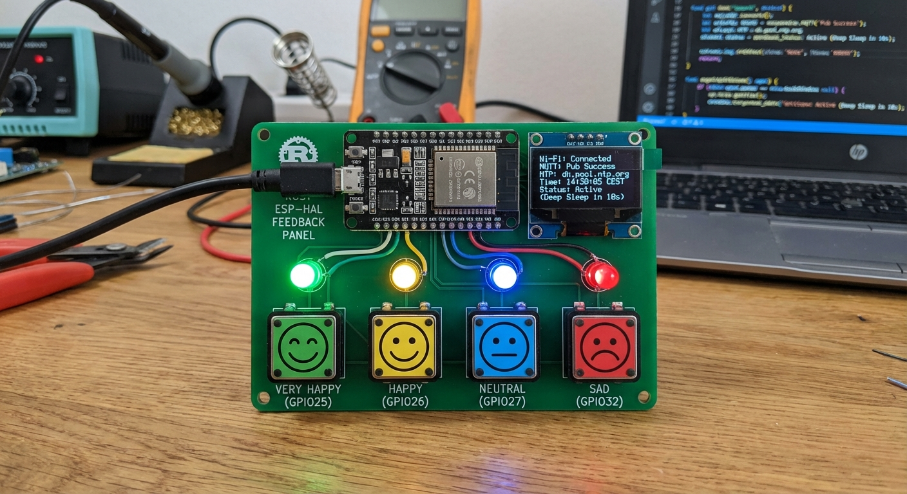
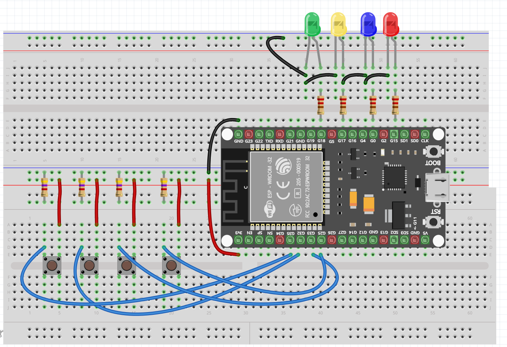

# ESP32 Smiley Feedback Panel





## Demo


A Rust-based embedded feedback panel for the ESP32 using `esp-hal`. This project implements a smiley feedback system with 4 buttons and corresponding LEDs that publishes ratings to an MQTT broker.

## Features

- **4 Buttons with 4 LEDs** - Smiley feedback panel with ratings:
  - Button 1: Very Happy (Green LED)
  - Button 2: Happy (Yellow LED)
  - Button 3: Neutral (Blue LED)
  - Button 4: Sad (Red LED)
- **Wi-Fi Connectivity** - Connects to Wi-Fi using WPA2 authentication with credentials stored in `.env` file
- **MQTT with TLS 1.3 Encryption and Authentication** - Publishes button press events with JSON payloads including timestamps and emotions
- **NTP Time Synchronization** - Syncs with Denmark NTP server (`dk.pool.ntp.org`) with Copenhagen timezone support
- **Button Debouncing** - Software debounce (50ms) prevents false triggers from button bounce
- **Deep Sleep Mode** - Power-saving deep sleep after 10 seconds of inactivity with EXT1 GPIO wakeup
- **LED Feedback** - Visual confirmation with 500ms LED display on button press
- **RTC GPIO Wake** - Uses RTC-capable pins (GPIO25, GPIO26, GPIO27, GPIO32) for deep sleep wakeup

## Development

### Prerequisites

Make sure to have esp-rs dependencies installed. Follow the official documentation: https://docs.espressif.com/projects/rust/book/getting-started/toolchain.html

For Xtensa Devices:

```sh
cargo install espup --locked
cargo install esp-generate --locked
cargo install espflash --locked
```

### Environment Configuration

Copy the example environment file and configure your settings:

```sh
cp .env.example .env
```

Edit `.env` with your network and MQTT details:

```
WIFI_SSID=your_wifi_network_name
WIFI_PASSWORD=your_wifi_password
MQTT_BROKER_IP=192.168.8.222
MQTT_USERNAME=your_mqtt_username
MQTT_PASSWORD=your_mqtt_password
```

## MQTT Broker Setup

The project includes a local MQTT broker (Mosquitto) with TLS support using Docker.

### Prerequisites

- [Docker Engine](https://docs.docker.com/engine/install/) installed

### Generate TLS Certificates

Generate self-signed certificates for secure MQTT communication from the project root:

```sh
./genssl.sh
```

This creates:
- `mosquitto/certs/ca.crt` - CA certificate (needed by ESP32 client)
- `mosquitto/certs/server.crt` / `server.key` - Server certificate and key

### Set MQTT Credentials

Create a password file with your MQTT credentials:

```sh
docker run -it --rm -v ./mosquitto/config:/mosquitto/config eclipse-mosquitto mosquitto_passwd -c /mosquitto/config/password_file your_username
```

Replace `your_username` with your desired username. You'll be prompted to enter a password.

**Important:** Update your `.env` file with the same MQTT credentials:

```
MQTT_USERNAME=your_username
MQTT_PASSWORD=your_password
```

### Start the MQTT Broker

From the project root directory:

```sh
docker compose up -d
```

The broker will be available on:
- Port `8883` - MQTTS (TLS)
- Port `1883` - Plain MQTT (localhost only, for testing)

### Testing the Connection

**Terminal 1 - Subscribe to feedback topic:**

```sh
mosquitto_sub -h 192.168.8.222 -p 8883 --cafile mosquitto/config/certs/ca.crt -u elev1 -P password -t "esp32/feedback" -v
```

**Terminal 2 - Publish a test message:**

```sh
mosquitto_pub -h 192.168.8.222 -p 8883 --cafile mosquitto/config/certs/ca.crt -u elev1 -P password -t "esp32/feedback" -m "test message"
```

You should see the message appear in Terminal 1.

### View Broker Logs

```sh
docker compose logs -f
```

## Build and Flash

To build, upload the code, and monitor the ESP32 serial output:

```sh
cargo run --release
```

## Documentation

The project documentation is written in [Typst](https://typst.app/).

### Building Documentation

Ensure you have `typst` installed.

To compile the logbook or portfolio:

```sh
# Compile a specific file
typst compile docs/logbog.typst
typst compile docs/arbejds-portfolio.typst
```

### Watch Mode

To automatically recompile when the file changes:

```sh
typst watch docs/logbog.typst docs/logbog.pdf
```
